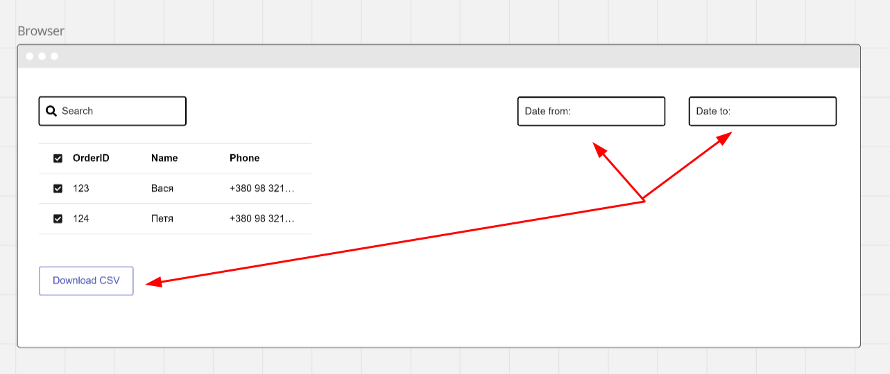

# Задача C7-123. Подключить провайдера обработки заказов

## Описание

Сейчас все заявки с нашего сайта (демо его работы https://www.loom.com/share/9e1eef433bc74c9b8b7b630ae2dca3c2) попадают на почту orders@plumbus.com. 
Это была нормальная система, но сейчас у нас много заказов и мы часто теряем заявки в почтовом ящике. 
Нужно подключить внешнего провайдера обработки заказов OrderMFK, чтобы все заявки автоматически попадали в CRM. 
Уже оттуда мы сможем *раз в сутки* легко выгружать заказы в Excel и обрабатывать их. 
А также выгружать выгружать все заказы *за месяц* для бухгалтерии.



## Внешний провайдер OrderMFK

OrderMFK предоставляет API для отправки заказов.

Для отправки задания на создание заказа нужно сделать POST запрос на адрес https://api.ordermfk.com/orders с параметрами:
- order_id - уникальный идентификатор заказа
- order_date - дата заказа в формате YYYY-MM-DD
- customer_name - имя заказчика
- customer_phone - телефон заказчика

Пример запроса:
```
POST /orders
{
  "order_id": "123",
  "order_date": "2024-01-01",
  "customer_name": "Микола",
  "customer_phone": "+38098 123 45 67"
}
```

После отправки запроса на создание заказа, OrderMFK вернет ответ в формате JSON:
```
{
  "status": "waiting",
  "order_id": "123"
}
```

Для проверки статуса заказа нужно сделать GET запрос на адрес https://api.ordermfk.com/orders/{order_id}.
OrderFK вернет статус заказа в формате JSON:
```
{
  "status": "processing",
  "order_id": "123"
}
```

## Требования

1. Научиться отправлять заказы в OrderMFK и проверять их статус.
2. При отправке заказа в OrderMFK должен быть обработан случай, когда OrderMFK не доступен. В таком случае нужно отправить заказ на почту как раньше.
3. При проверке статуса заказа должен быть обработан случай, когда заказа с таким order_id не существует.
4. При отправке заказа в OrderMFK должен быть обработан случай, когда заказ с таким order_id уже существует.
5. Уникальный идентификатор заказа order_id должен быть уникальным для всех заказов в системе. Можно использовать текущую дату 
и время в формате YYYYMMDDHHMMSS и хэш от данных заказа.
6. При отправке заказа в OrderMFK должен быть обработан случай, когда данные заказа не прошли валидацию. В таком случае нужно слать заказ на почту как раньше.
7. Так как OrderMFK имеют ограничение по кол-ву запросов (100 в час), то нужно реализовать очередь заказов.
8. Деллайн: завтра в 10:00

